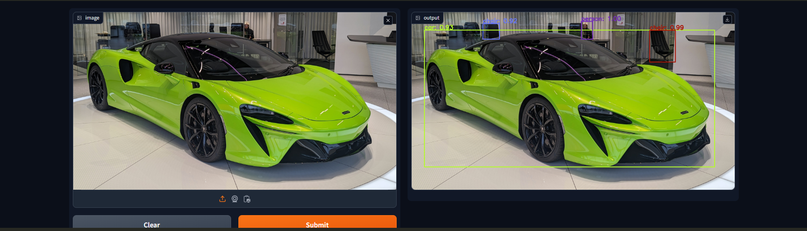

# Documentation for the Homework
This is the documentation for the homework. The task was to make a simple web application that uses a machine learning model to give the prediction of chosen domain.

## Used model:
- ### [DETR](https://huggingface.co/facebook/detr-resnet-50) - Object detection model made by Facebook AI.

## Used Libraries:
- ### [Gradio](https://www.gradio.app/) - A library that allows to create a web application for applications easily.
- ### [PyTorch](https://pytorch.org/) - A library that is used for machine learning and deep learning.
- ### [Pillow](https://pillow.readthedocs.io/en/stable/) - A library that is used for image processing.

## Installation:
First of all you have to install the [Docker](https://www.docker.com/) on your machine.

To launch the app, run the following command:
### CPU-bound app
```bash
docker build -t <image_name> .
docker run -p <EXTERNAL_PORT>:7000 <image_name>
```

### GPU-bound app
Requirements:

- CUDA compatible GPU
- installed [CUDA](https://docs.nvidia.com/cuda/cuda-quick-start-guide/index.html)
- installed [NVIDIA container tookit](https://docs.nvidia.com/datacenter/cloud-native/container-toolkit/latest/install-guide.html)
```bash
docker build -t <image_name> .
docker run --gpus all -p <EXTERNAL_PORT>:7000 <image_name>
```

## Usage:
Open the ```lesson_34_overview.ipynb``` Jupiter notebook and scroll down until Homework title achieved. Run the cells and open the link that is provided by Gradio. Then you can upload an image and see the prediction of the model. 

## Input/Output:
The input is an image, and the output is the same image but with the bounding boxes and labels of the detected objects.

## Example of input/output:


## Modeling info:
The DETR model is an encoder-decoder transformer with a convolutional backbone. Two heads are added on top of the decoder outputs in order to perform object detection: a linear layer for the class labels and a MLP (multi-layer perceptron) for the bounding boxes. The model uses so-called object queries to detect objects in an image. Each object query looks for a particular object in the image. For COCO, the number of object queries is set to 100.

The model is trained using a "bipartite matching loss": one compares the predicted classes + bounding boxes of each of the N = 100 object queries to the ground truth annotations, padded up to the same length N (so if an image only contains 4 objects, 96 annotations will just have a "no object" as class and "no bounding box" as bounding box). The Hungarian matching algorithm is used to create an optimal one-to-one mapping between each of the N queries and each of the N annotations. Next, standard cross-entropy (for the classes) and a linear combination of the L1 and generalized IoU loss (for the bounding boxes) are used to optimize the parameters of the model.
### Training data:
  The DETR model was trained on COCO 2017 object detection, a dataset consisting of 118k/5k annotated images for training/validation respectively.


